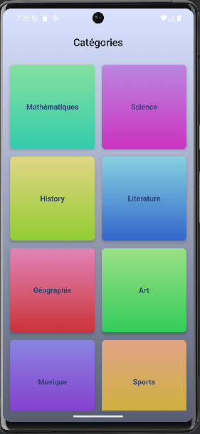
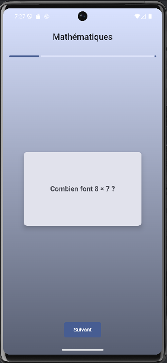
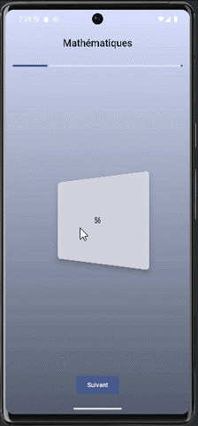

# Application Flashcards
**Fait par Gwénolé ALLAL** **-** **Juin 2025**

## Présentation du projet
Application mobile Android en **Kotlin** utilisant une architecture **MVVM**, avec le kit d'outils **Jetpack Compose**. Une persistance des données à également été rajoutée avec la bibliothèque **Room**

## Capture du projet

 

## Caractéristiques techniques
- **Langage** : Kotlin
- **Architecture** : MVVM (Model-View-ViewModel)
- **UI** : Jetpack Compose (avec Material3)
- **Persistance** : Room (SQLite)
- **Gestion de l’état** : StateFlow
- **Navigation** : Navigation Compose (`NavHost`)

## Caractéristiques fonctionnelles

L'application FlashCard propose les fonctionnalités suivantes : 

### 1. Ecran d'accueil

- [x] L'écran d'accueil affiche la liste des catégories disponibles.
- [x] Chaque catégorie est représentée de manière visuelle.
- [x] Un clic sur une catégorie démarre une session de révision.

### 2. Session de révision

- [x] Les cartes de révision sont affichées une à une dans l'ordre défini.
- [x] Chaque carte présente la question au recto.
- [x] L'utilisateur peut cliquer sur la carte pour révéler la réponse via une animation de rotation.
- [x] Une animation de transition accompagne le passage à la carte suivante.
- [x] Une barre de progression permet à l'utilisateur de visualiser l'avancement de la session.
- [x] Lorsque toutes les cartes d'une catégorie ont été affichées, l'application retourne automatiquement à l'écran d'acceuil

### 3. Navigation et animation

- [x] L'application doit utiliser le système de navigation Jetpack Compose (`NavHost`) pour gérer les différents écrans (accueil, session de révision).
- [x] Des animations doivent être présentes pour la rotation de la carte (question -> réponse) et pour la transition entre les cartes.
- [x] Une attention particulière est attendue sur la fluidité de l'expérience utilisateur.
  
> Le bonus de l'utilisation d'une base de données locale (Room) pour stocker les cartes à été réalisé

### Commentaires sur la réalisation des fonctionnalités

Lors du développement j'ai du utiliser un Android Virtual Device. Même en allouant des ressources supplémentaire à l'émulateur j'ai eu tout au long du développement des saccades sur l'application.  N'ayant pas de téléphone Android pour tester en réel, je ne peux pas savoir si mon application est fluide ou non sur un telephone physique.

J'ai quand même réalisé une étude de performance via l'analyseur de code d'Android Studio et aucune anomalie n'a été constatée. J'en déduis donc que mon application est fluide sur un téléphone physique sous Android.

## Modification du template de base

J'ai pris la liberté de modifier les éléments du squelette d'application.

## Outils utilisés pour la réalisation de ce projet 

- JetBrain Android Studio
    - IDE
    - Linter
    - Emulateur Android

- Android Developer
    - Documentation Jetpack Compose
    - Documentation StateFlow
    - Documentation Room

- Stack Overflow
    - Solution aux petits problèmes

- GitHub Copilot
    - Refactorisation du code
    - Explication des bugs non corrigeables via l'IDE

- ChatGPT & LeChat Mistral
    - Création de la DA de l'application
    - Correction "avancée" des problèmes rencontrés
    - Création du set de catégories/questions
    - Assistance au développement des animations